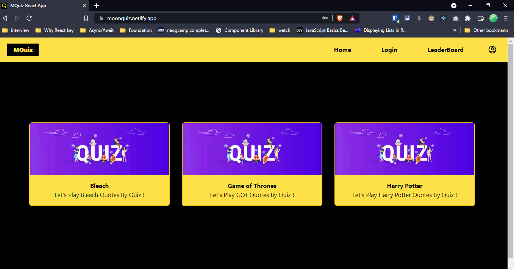

# MoonQuiz

A Quote Quiz App built with React⚛️ + TypeScript😍

### Preview
Deployed App: [https://moonquiz.netlify.app/](https://moonquiz.netlify.app/)
#Home Page


    


Backend source code (Express & Mongoose): [https://github.com/KuldeepSinghRathore/MQuiz/tree/main/server](https://github.com/KuldeepSinghRathore/MQuiz/tree/main/server)

### Features:
1. Local storage persistence of auth state
2. Private and public routes: Private routes accessible only on login
3. User actions like save Score to Server  etc.
4. React⚛️ + TypeScript😍
5. JWT Authentication🔐
6. Clean and responsive layout
7. Select from different levels
8. Quiz result at the end
9. LeaderBoard To Show all Users Score 
10. Responsive design for mobile and desktop
11. React: useContext, useReducer, useEffect, useState,axios interceptors, functional components


Bootstrapped with `create-react-app`

## Run Locally

#### Get started

1. **Clone the repo:**
```bash
  $ git clone https://github.com/KuldeepSinghRathore/MQuiz.git
```
2. **Install required node modules:**
```bash
  $ npm install
```
3. **Start the dev server:**
```bash
  $ npm start
```
Open the `localhost` link in the browser.
Happy hacking!       

## 🔗 Links
[](https://twitter.com/__Kuldeep_Singh)

[](https://www.linkedin.com/in/kuldeep--singh/)
